## About me
My name is Thomas Roelig and I work as an airline pilot for a large german cargo airline. I started my carrier flying passenger airplanes (737NG Family / A320 Family) and then changed to cargo operations (A300-600RF). 
I always enjoyed tinkering and making stuff and found a passion in 3D printing and programming. This led to the beginning of my self-taught programming journey. After the usual tutorial hell, I was looking for a more structured approach and found CS50. 
Due to my job I have alot of time in hotels during layovers and teaching myself to code seems to make the time spend away from home so much more productive and worthwhile.

## Tools and Languages

  

## Certificates

CS50x

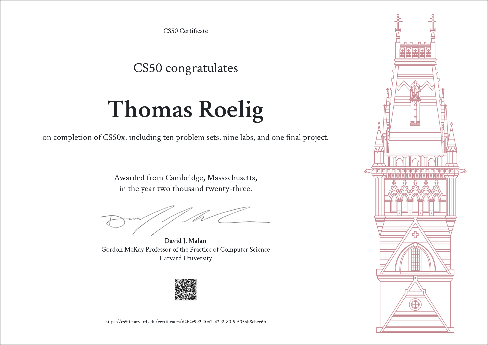 
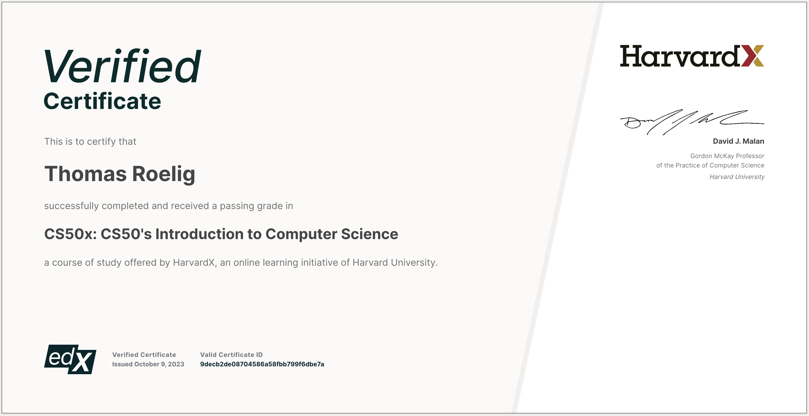

  
Coursera

  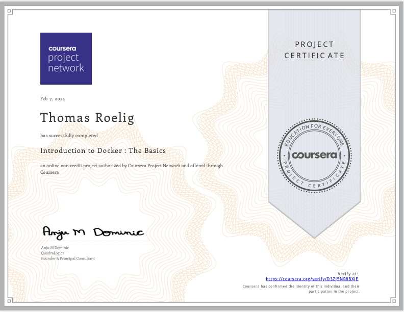 
  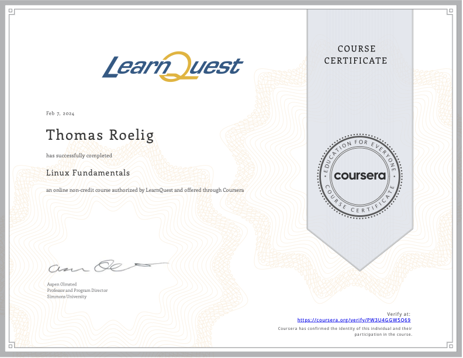 
  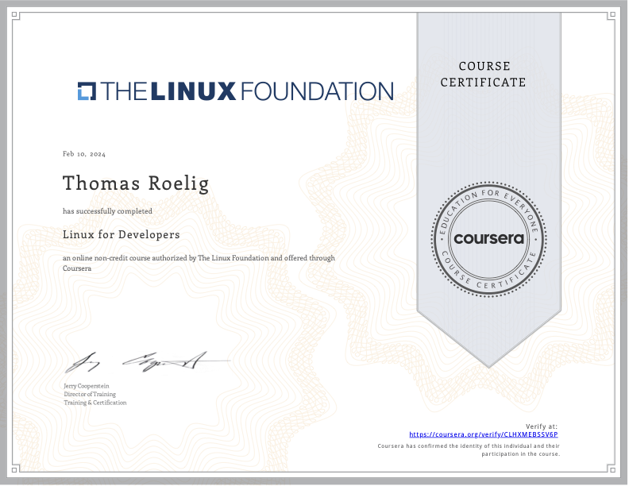 
  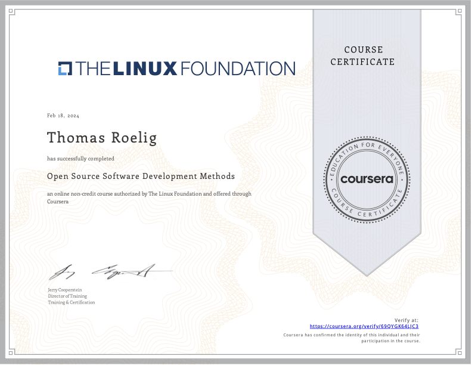 
  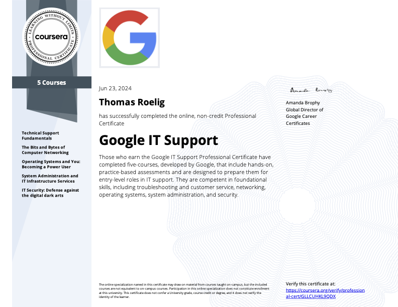

## Projects

Systems Reference for A300

Website to quickly review the systems of the A300-600RF and create a review pdf for systems and non-normal procedures. For company internal use only, therefore a private repository. The website was build using Flask, MySQL to store all system data and Javascript to enable theme switching for pico.css. I will release a blank version (without the company database file). This may be of use for projects that store study notes, recepies ...

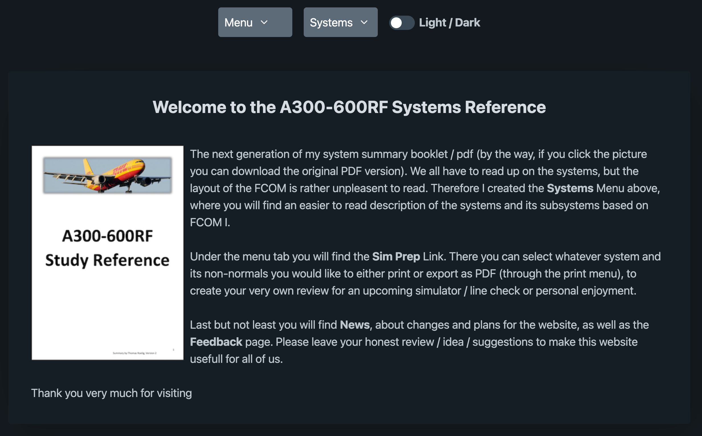 
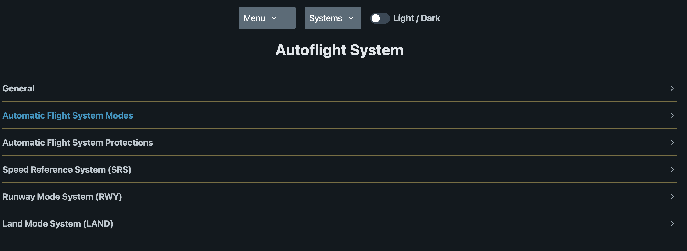 
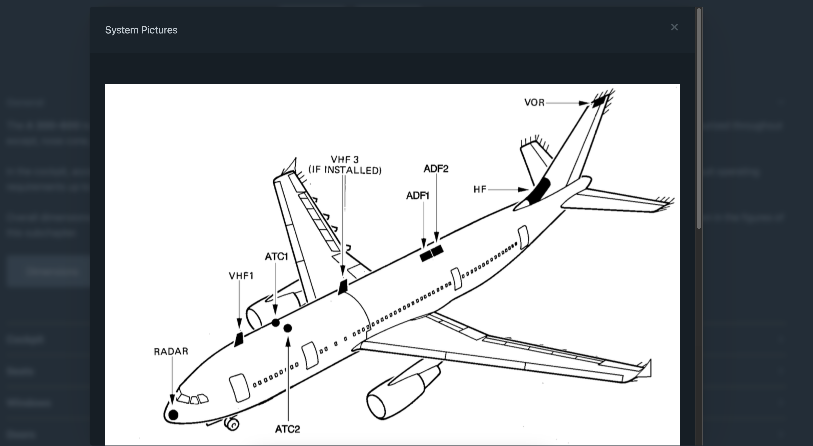 
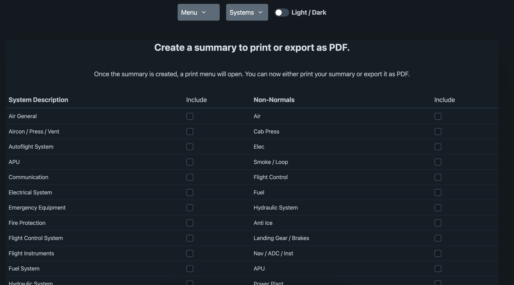 

Simple Code Timer - Python / Tkinter

I wanted to build a small code timer for myself, to time my sessions. I took this idea to learn a bit of tkinter to create desktop python apps. Since I found tkinter to look a bit old'ish for my taste, I tried tkkbootstrap. This made the looks of it bit more modern.<a href="https://github.com/JetDev22/Code-Timer"> Go to Project here</a>

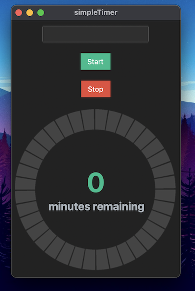
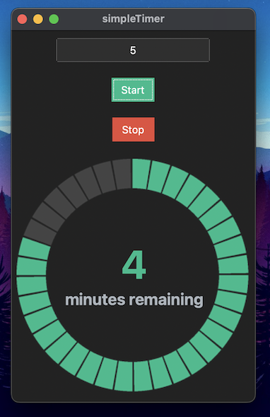 

BTC Portfolio Tracker PI / CLI

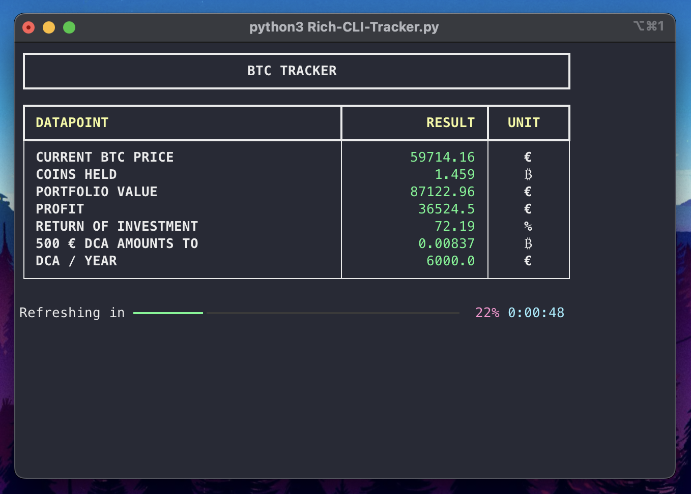 

Two BTC Portfolio Tracker based on python.
<ol><li>One displays to an 16x2 LCD connected to any Raspberry Pi</li>
<li>One uses the CLI</li>
<li>One uses a 64x64 LED Matrix</li></ol>
<a href="https://github.com/JetDev22/BTC-Tracker">Go to the project here</a>

React BTC Portfolio

 

React App to show some stats on your &#8383; portfolio
<a href="https://github.com/JetDev22/react-btc-portfolio">Go to the project here</a>

Advent of Code

 

My Advent of Code solutions. Great way to keep coding motivation up

<a href="https://github.com/JetDev22/AdventOfCode?tab=readme-ov-file"> Find my solutions here</a>

