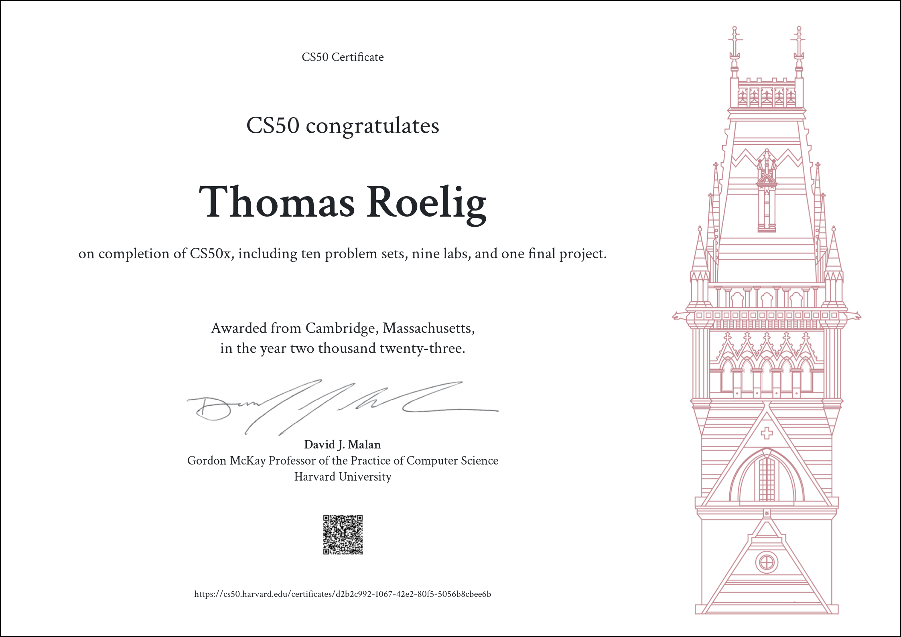
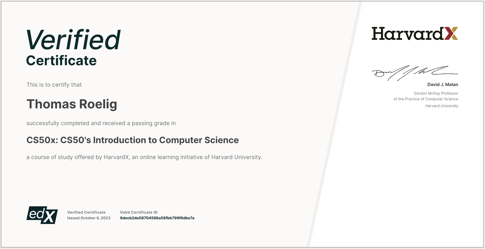

## About me
My name is Thomas Roelig and I work as an airline pilot for a large german cargo airline. I started my carrier flying passenger airplanes (737NG Family / A320 Family) and then changed to cargo operations (A300-600RF). 
I always enjoyed tinkering and making stuff and found a passion in 3D printing and programming. This led to the beginning of my self-taught programming journey. After the usual tutorial hell, I was looking for a more structured approach and found CS50. 
Due to my job I have alot of time in hotels during layovers and teaching myself to code seems to make the time spend away from home so much more productive and worthwhile. 

## Tools and Languages

## Certificates

CS50x

 

