## About me
<ul>
  <li>Airline Pilot with a love for tech</li>
  <li>Trying to learn something new every day</li>
  <li>3D Printing</li>
  <li>Programming</li>
  <li>CyberSecurity</li>
  <li>Linux</li>
  <li>Embedded Systems</li>
</ul>

## Tools and Languages

## Codewars

## Advent of Code
     

## Certificates

CS50x

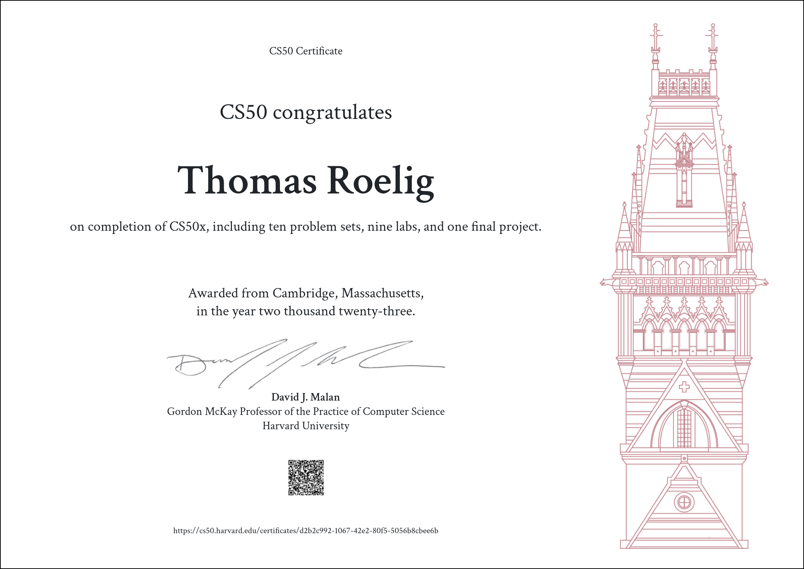 
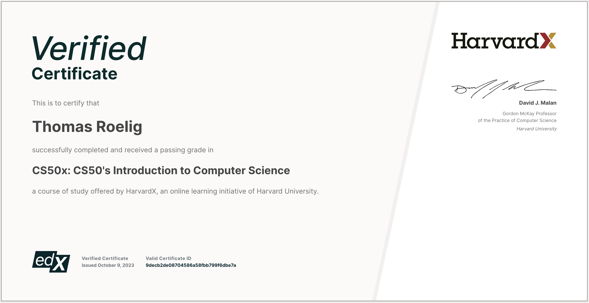

  
CS50P

  

  
Coursera

  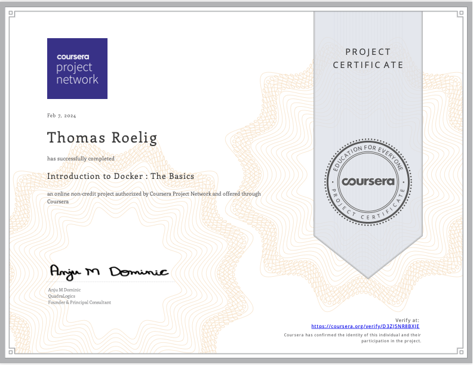 
  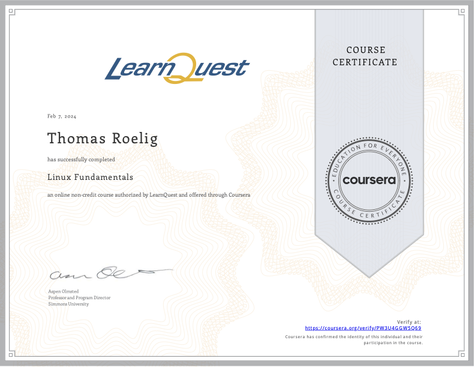 
   
   
  

  
TryHackMe

  

## Projects

Systems Reference for A300

Website to quickly review the systems of the A300-600RF and create a review pdf for systems and non-normal procedures. For company internal use only, therefore a private repository. The website was build using Flask, MySQL to store all system data and Javascript to enable theme switching for pico.css. I will release a blank version (without the company database file). This may be of use for projects that store study notes, recepies ...

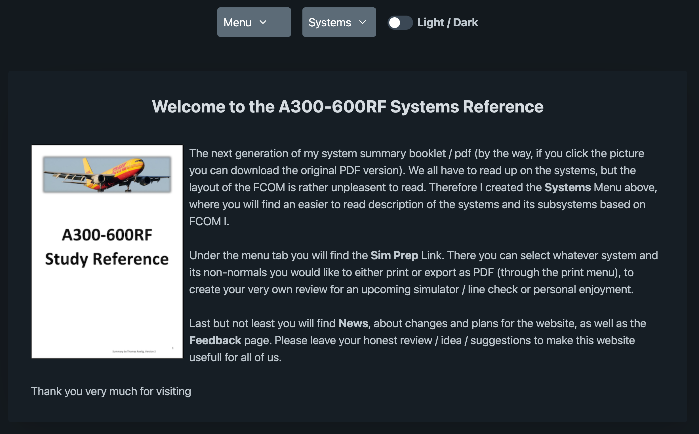 
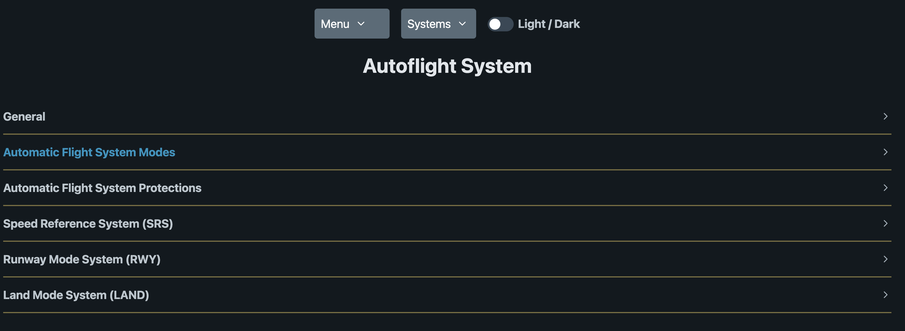 
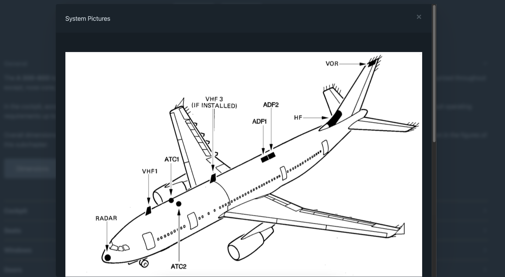 
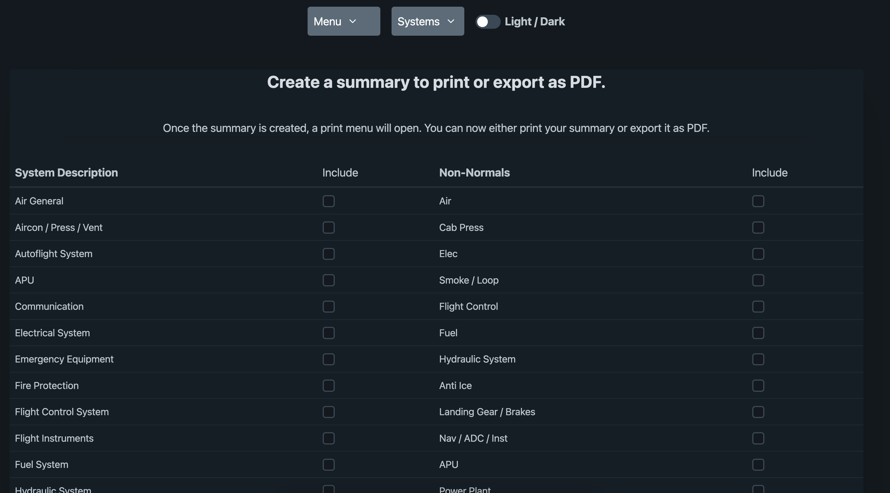 

Simple Code Timer - Python / Tkinter

I wanted to build a small code timer for myself, to time my sessions. I took this idea to learn a bit of tkinter to create desktop python apps. Since I found tkinter to look a bit old'ish for my taste, I tried tkkbootstrap. This made the looks of it bit more modern.<a href="https://github.com/JetDev22/Code-Timer"> Go to Project here</a>

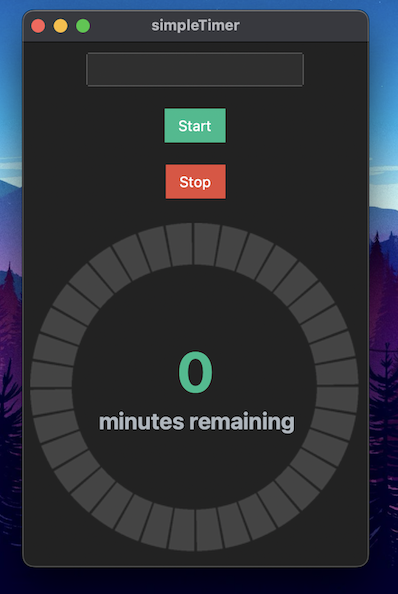
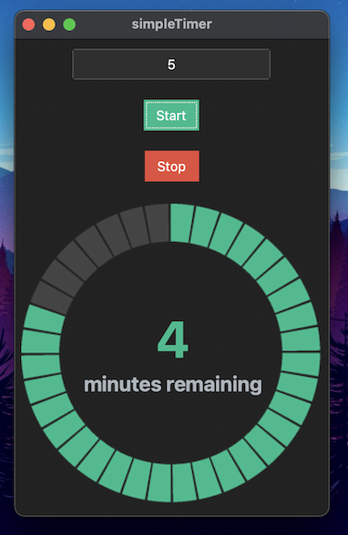 

BTC Portfolio Tracker PI / CLI

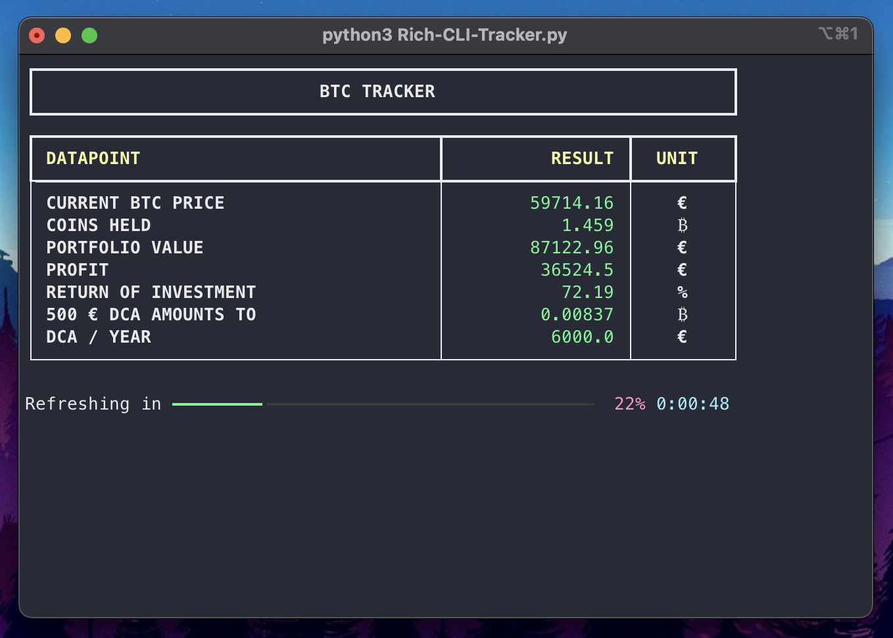 

Two BTC Portfolio Tracker based on python.
<ol><li>One displays to an 16x2 LCD connected to any Raspberry Pi</li>
<li>One uses the CLI</li>
<li>One uses a 64x64 LED Matrix</li></ol>
<a href="https://github.com/JetDev22/BTC-Tracker">Go to the project here</a>

React BTC Portfolio

 

React App to show some stats on your &#8383; portfolio
<a href="https://github.com/JetDev22/react-btc-portfolio">Go to the project here</a>

  
Sveltekit BTC Portfolio

   
  
Sveltekit Version of my &#8383; Portfolio tracker.
  <a href="https://github.com/JetDev22/sveltekit-BTC-Portfolio/">Go to project here</a>

Advent of Code

 

My Advent of Code solutions. Great way to keep coding motivation up

<a href="https://github.com/JetDev22/AdventOfCode?tab=readme-ov-file"> Find my solutions here</a>

